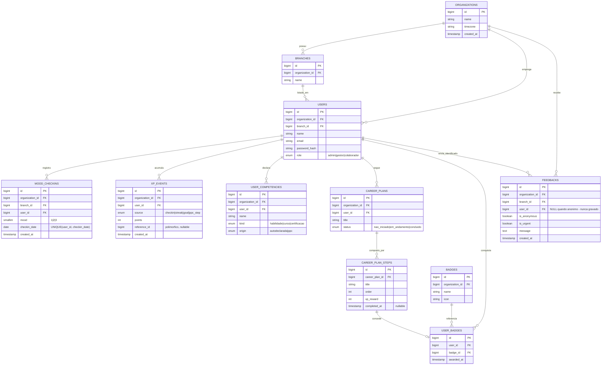
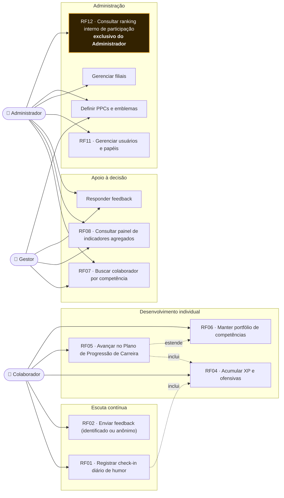
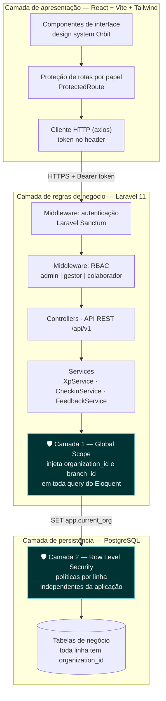
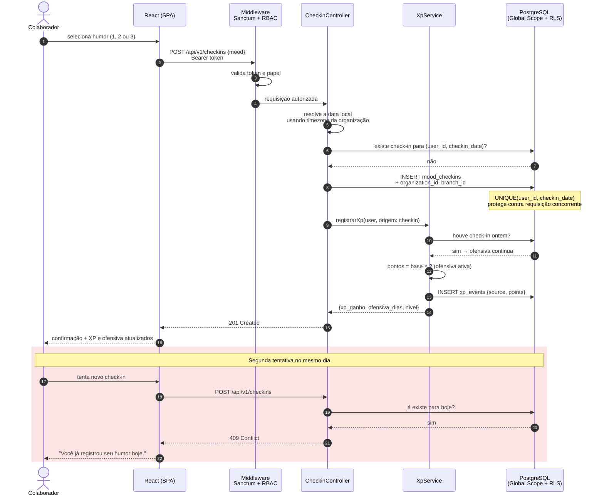
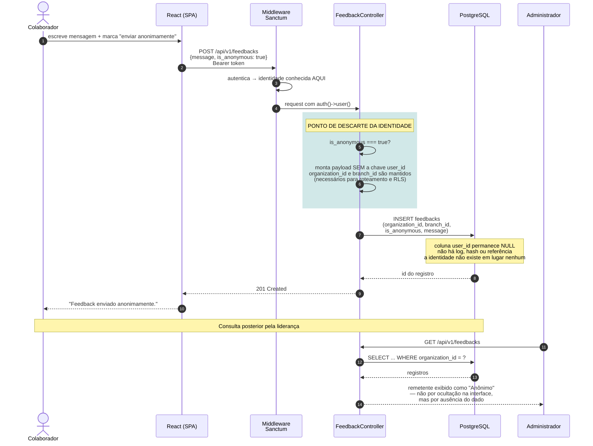
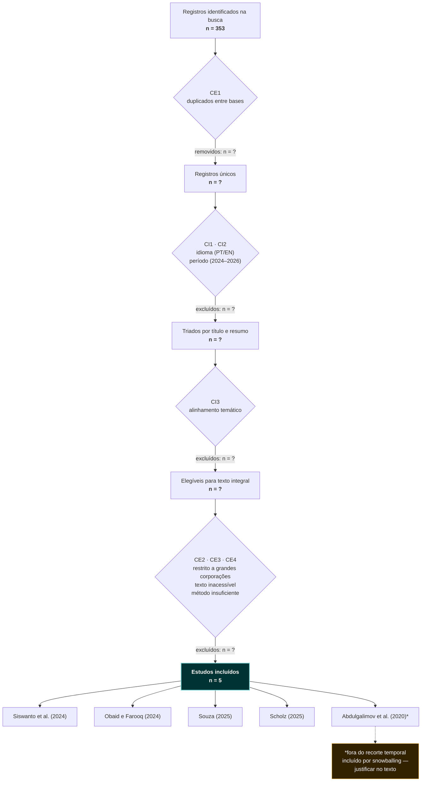

# Orbit RH — Diagramas (Mermaid)

Salve cada bloco como um arquivo `.mmd` em `docs/diagramas/` do repositório novo.

> ⚠️ **Estes diagramas são hipóteses sobre o seu modelo, não verdade.** Revise cada um
> contra o que você vai implementar e ajuste. Revisar é parte de dominar o projeto —
> se você aceitar sem ler, repetimos o erro que estamos consertando.

---

## 01 — Entidade-Relacionamento

`docs/diagramas/01-der.mmd`

Legenda para o artigo: *Figura X — Modelo de dados do Orbit RH. Toda entidade de
negócio carrega `organization_id`, base do isolamento multitenant descrito em 2.4.*



**Pontos para você defender:**

- `organization_id` em toda tabela de negócio → é o que o Global Scope e as políticas de
  RLS usam como filtro (RNF02, RNF03).
- `UNIQUE(user_id, checkin_date)` → a unicidade do RF01 é garantida **pelo banco**, não
  só pela aplicação. Se a banca perguntar "e se dois requests chegarem juntos?", a
  resposta é a constraint.
- `XP_EVENTS` como log de eventos, não contador no `users` → auditável e reconstruível.
  Se perguntarem por que, a resposta é: você consegue provar de onde veio cada ponto.
- `FEEDBACKS.user_id` nullable **e não preenchido** quando anônimo → o campo existe para
  o feedback identificado; no anônimo ele simplesmente não é escrito.

---

## 02 — Casos de uso

`docs/diagramas/02-casos-de-uso.mmd`

Mermaid não tem diagrama de caso de uso nativo. Este `flowchart` é a convenção aceita e
renderiza bem.



**Note o que este diagrama torna visível:** o Gestor vê o painel da sua unidade; o
Administrador vê todas. Essa distinção precisa aparecer também no código (RBAC + escopo
por filial). Se você desenhar assim e implementar diferente, criou uma contradição nova.

**O UC15 está destacado de propósito.** Ele é o único caso de uso ligado a um único
ator, e é o que carrega a decisão de privacidade mais delicada do sistema: o ranking
nomeia pessoas. Ao desenhá-lo isolado no Administrador, o diagrama já comunica que a
comparação entre pares não é exposta a pares — que é exatamente o argumento da seção 2.3
revisada.

---

## 03 — Arquitetura em camadas

`docs/diagramas/03-arquitetura.mmd`

Este é o diagrama que falta na seção 4.4 — você descreve as três camadas em texto, sem
figura.



**Os dois blocos destacados são a sua contribuição técnica.** Este diagrama é o slide
central da sua apresentação: mostre que, se a Camada 1 falhar, a Camada 2 ainda barra.
Depois rode o teste ao vivo.

---

## 04 — Sequência: check-in diário + XP

`docs/diagramas/04-seq-checkin.mmd`



**Cenários de teste que este diagrama define** (e que o artigo, em 4.4, promete):

- Check-in duplicado no mesmo dia → 409.
- Check-in às 23h59 e outro às 00h01 → **dois registros válidos**, dias diferentes.
- Ofensiva quebra quando há um dia sem check-in.
- XP dobrado só quando a ofensiva está ativa.

---

## 05 — Sequência: feedback anônimo ⭐

`docs/diagramas/05-seq-feedback-anonimo.mmd`

O diagrama mais importante do conjunto. Ele torna visual a afirmação mais forte do seu
trabalho.



**O argumento que você faz na banca:** o anonimato não é uma decisão de apresentação
(esconder o nome na tela), é uma decisão de persistência (o nome nunca foi gravado).
Reversibilidade é impossível porque não há o que reverter. Isso é o que a seção 2.6
chama de "anonimato técnico irreversível por construção", e atende ao princípio da
necessidade da LGPD.

**Teste que prova isso:**

```php
public function test_feedback_anonimo_nao_persiste_remetente(): void
{
    $user = User::factory()->create();

    $this->actingAs($user)->postJson('/api/v1/feedbacks', [
        'message'      => 'Sobrecarga na equipe de logística.',
        'is_anonymous' => true,
    ])->assertCreated();

    $this->assertDatabaseHas('feedbacks', [
        'message' => 'Sobrecarga na equipe de logística.',
        'user_id' => null,
    ]);

    // nenhum feedback anônimo, em nenhuma hipótese, carrega remetente
    $this->assertSame(
        0,
        Feedback::where('is_anonymous', true)->whereNotNull('user_id')->count()
    );
}
```

---

## 06 — Fluxo de seleção do mapeamento sistemático

`docs/diagramas/06-selecao-mapeamento.mmd`

Resolve a lacuna A2 do plano mestre. O protocolo de Kitchenham espera este fluxo, e hoje
seu artigo só informa o começo (353) e o fim (5).

⚠️ **Os números intermediários abaixo são ilustrativos.** Substitua pelos reais quando
refizer a triagem — e é por isso que vale refazer com mais bases (item A1 do plano).



Este diagrama já embute a correção do bloqueador **B2** (Abdulgalimov é de 2020, fora do
recorte 2024–2026). Ao desenhá-lo assim, você transforma uma inconsistência em uma
decisão metodológica explícita — que é como se resolve esse tipo de problema em pesquisa.

---

## Renderizar para o artigo

```bash
npm i -g @mermaid-js/mermaid-cli

for f in docs/diagramas/*.mmd; do
  mmdc -i "$f" -o "docs/diagramas/png/$(basename "${f%.mmd}").png" \
       -b transparent -s 3
done
```

`-s 3` gera em 3× a resolução — necessário para não sair borrado no PDF impresso.

Para o Word/PDF final, prefira **SVG** (`-o arquivo.svg`) se o seu editor aceitar:
vetorial não perde qualidade em nenhum zoom.
